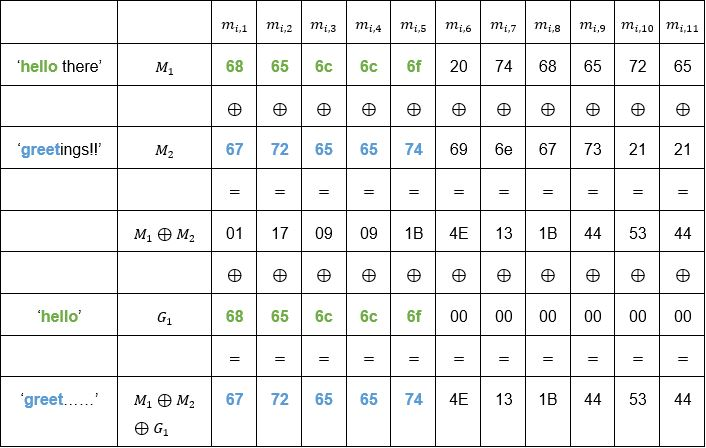
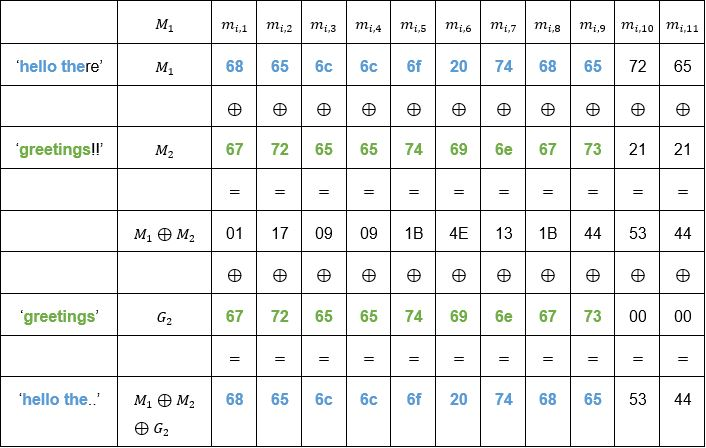
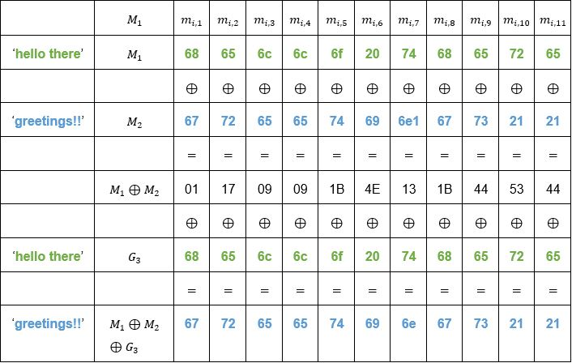

# Introduction

As the number of people and devices connected via the internet grows, so does the amount of data being sent. Much of the data is not meant to be public but only accessible to smaller numbers of people. The internet itself on the other hand is meant to be accessible to everyone. The openness of the internet in a way then goes against the idea private communication. Data flowing from one destination to another can be intercepted in many points along the way by third parties who are not intended to be able to observe the data. This results in a need for ways to communicate securely over a public medium. Since the data being sent is in most cases still interceptable it needs to be sent in a form that is unreadable to unintended recipients. Numerous ways to achieve this have been thought of and tried and some of them have been found to work better than others.

The infrastructure of the internet and the way computers work and handle communications together with the way people have come to expect data transmissions to work poses limitations on the ways secure communications can be implemented. Asymmetric cryptography is generally a safer way to achieve secrecy of communications, but the computational costs are larger, processing takes more time, and the message size is limited. Larger amounts of data are therefore encrypted using symmetric key algorithms where the same key is used for encryption and decryption of messages. Key sizes in symmetric ciphers are smaller and computations take less time.

Symmetric cryptography in the digital realm often uses block ciphers that process data of predetermined length called blocks. Since messages can be longer than the size of a single block different methods have been introduced to try and chain the processing of blocks without compromising security. The way the blocks in a single message are processed is called a block cipher mode of operation (NIST a.). The purpose of this paper is to compare some of the most well-known modes.

# Block ciphers

A block cipher is an invertible deterministic secret-key algorithm that takes a fixed length input block and outputs a block that is the same length. Deterministic here meaning that the same input together with the same key will always result in the same output and invertible meaning that for the encryption function $E$ there exists a decrypting function $D$ such that $D=E^{-1}$. We can write this in the form $∀P:D(K,E(K,P))=P$ where $P$ is a plaintext block and $K$ is the secret key. (NIST b.)

Like the name suggests, encryption and decryption are carried out by dissecting the data to be encrypted into smaller units called blocks which are handled by the algorithm. This is where different modes of operation come into play as they determine how the block cipher is applied to messages whose length exceeds the block size in use. Block sizes can vary but typical sizes are 64, 128 and 256 bits. (Villanueva.) Because UTF-8 encoding uses one to four bytes to represent characters, the block size dictates how many characters fit into a single block (Unicode.org). For example, the character *‘n’* is 110 in decimal, `0x6E` in hexadecimal and `0b01101110` in binary, meaning it can be represented by a single byte. If the block size was 64 bits, then eight *‘n’* characters would equal to a single block.

In general, a 64-bit block size is nowadays considered to be too small. As a result of the birthday paradox, when the same key is used for large amounts of data with certain modes, the probability of a collision happening grows too high. A collision meaning a case where two identical ciphertext blocks are produced. Identical outputs will in CBC (cipher block chaining) mode, for example, imply that the inputs are identical, which will lead to the discovery of the result of the XOR operation of two plaintext blocks. As a result, most security protocols today implement larger block sizes. AES which is widely used in TLS in securing HTTPS traffic, for example, uses a 128-bit block size. (Bhargavan & Leurent 2016.) One could summarize that too small of a block size results in a weaker encryption and too large of a block size makes encryption and decryption cumbersome, the calculations require more time and resources.

Key length for the cipher is a simpler issue. As block ciphers are symmetric key encryptions, the key must be kept secret. Therefore, the most important feature of a key is that it is in practice too long to be brute-forced i.e., it will take an unreasonable amount of time and computing power to test all possible keys. AES for example supports key sizes of 128, 192 and 256 bits (NIST 2001.). For a 128-bit key there are $2^{128}$ possible candidates, which means it would take a huge amount of time and energy to try all the possible combinations of ones and zeroes. This is of course assuming that the whole possible key space is utilized by the key generating process.

Since block cipher algorithms operate on whole blocks of data some modes require the last block of data to be padded with extra bytes to reach the block size currently in use. After decrypting the message, the extra bytes are discarded as they contain no information relevant to the original message.

# ECB – Electronic Code Book

This is the simplest of the modes and its name hints to days before digitalization when actual physical code books were used in encrypting messages. All blocks are processed individually using the same key, which means that ECB is entirely deterministic and lacks diffusion as messages encrypted with the same key produce identical ciphertext blocks for identical plaintext blocks. (Dworkin 2001, 9–10.) This results in easy to recognize patterns in the ciphertext as messages often adhere to a standard format. Traditional letters and emails often begin with greetings and end in well-wishes. HTTP requests also follow a standard format so it can be relatively simple to start piecing together what are the plaintext counterparts of certain ciphertext blocks under the same key. ECB requires the plaintext to be a multiple of the block size so the last block may contain padding (Dworkin 2001, 17).

Figures 1 and 2 demonstrate the principle of encrypting and decrypting a message. The message here is too big to fit into a single block so it is divided into three eight-byte blocks $P_1,P_2,P_3$ which concatenated together form the original message plus possible padding bytes in $P_3$. The blocks are each individually run through the encryption algorithm using the same key and transformed into corresponding ciphertext blocks $C_1,C_2$ and $C_3$ which concatenated together form the ciphertext.

The decryption process is identical, only now the inputs to the decryption function are the ciphertext blocks, and of course the same key. Once the message is decrypted, the padding is removed, and the original message has now been recovered.

		
*Figure 1. ECB mode encryption (modified from source Wikipedia)*

		
*Figure 2. ECB mode decryption (modified from source Wikipedia)*

ECB is a mode that should never be used if any sort of proper secrecy is desired. Using even the most robust cipher algorithm will lead to weak encryption if combined with an unsecure mode of operation like ECB.

# CBC – Cipher Block Chaining

In CBC each encrypted cipher block is dependent on the previous blocks. This is because before encrypting a plaintext block it is first XORed with the previous ciphertext block and the result is then encrypted. For the first plaintext block there isn’t a previous cipher block, so a random block called the initialization vector $(IV)$ is used instead. The formula for encryption is $C_i=E(K,C_{i-1}⊕P_i)$ and for decryption $P_i=D(K,C_i)⊕C_{i-1}$ where $C_0=IV$. (Dworkin 2001, 10-11.) CBC also requires all of the blocks to be of the same length so the last block may contain padding bytes (Dworkin 2001, 17). Figures 3 and 4 visualize the encryption and decryption processes with 8-byte blocks.

		
*Figure 3. CBC mode encryption (modified from source Wikipedia)*

		
*Figure 4. CBC mode decryption (modified from source Wikipedia)*

The chaining of blocks with the XOR operation causes an avalanche effect in the ciphertext so that the same message encrypted with the same key results in a totally different ciphertext if a different $IV$ is used. Of course, re-using the same $IV$ under the same key reduces the security of CBC mode. The $IV$ should also be non-predictable to avoid certain types of attacks. The $IV$ has a critical role in CBC and should therefore be generated with care. (Hornsby 2013.)

The receiver of a message encrypted with CBC mode must receive the $IV$ as well, otherwise they won’t be able to decrypt the first ciphertext block. In general, the $IV$ used for generating a particular ciphertext is sent along the ciphertext to the receiver. For CBC to work as intended, the $IV$ must be random or pseudorandom to prevent possible attackers from predicting or guessing the $IV$ for the next message and it should also be authenticated so attackers can’t tamper with it and make the first block decrypt to what they want. It doesn’t however need to be secret after the encryption process is finished. (Hornsby 2013.)

# CTR – Counter Mode

Diffie and Hellman (1979, 397–427) introduced the counter mode already in 1979 but it remained unpopular for a long time. It gained interest in more recent years and was standardized by NIST in 2001. It benefits from the possibility of parallel encryption and decryption since the blocks are processed independently of each other in both cases. Preprocessing is also possible if the counter values are known before attaining the plaintext or ciphertext. (Dworkin 2001, 15–16.)

Like CBC, CTR also needs an $IV$, usually called a counter, which actually consists of a *nonce* (number used once) and a separate counter which are concatenated together, and together are n bits long, where n is the block length. For a given message the nonce stays the same for all blocks, while the counter is unique, and usually follows a simple increment-by-one procedure. The nonce should then be unique for all messages exchanged in a session and the counter unique for all blocks within a message. This way all nonce and counter combinations will be unique within a session. The nonce-counter combination does not need to be kept secret, only unique, and is often sent along the ciphertext block to the receiver for decryption. Like in the case with $IV$s in CBC mode, the purpose of the nonce-counter combination in CTR mode is to ensure identical plaintext blocks encrypt to different ciphertext blocks. The security of the mode comes from the other input to the encryption algorithm, namely the secret key, while the nonce-counter combination takes care of the uniqueness of the output. (Dworkin 2001, 18–19.)

Another useful feature of the CTR mode is that it does not require padding. This is because the last phase of encrypting is a XOR operation between output from the block cipher algorithm and a plaintext block. If the last plaintext block’s length is $l$ bits and it’s not the same as the current block size, only the $l$ most significant bits from the block cipher’s output are used for the XOR with the last plaintext block. This will result in the last ciphertext block to be of length $l$ also. The decryption process is almost identical to the encryption, only now the ciphertext blocks are XORed with the cipher’s output blocks. The same principle of only using the $l$ most significant bits of the last ciphertext block for the XOR applies. Figures 5 and 6 illustrate the encryption and decryption processes. (Dworkin 2001, 15–16.)

Let the nonce/counter combinations be denoted by $T_1,T_2,…,T_n$. The formula for encryption can then be written as $C_i=P_i⊕ O_i$, for $i < n$ and $C_n=P_n⊕MSB_l (O_n)$, where $O_i=E(key,T_i)$ and $l$ denotes the length of the last plaintext block $P_n$. For decryption it follows from the properties of the XOR operator that $P_i=C_i⊕O_i$ for $i < n$ and $P_n=C_n⊕MSB_l (O_n)$. Of note is that for both encryption and decryption using CTR mode only the block cipher encryption algorithm is needed. (Dworkin 2001, 15–16.)

		
*Figure 5. CTR mode encryption (modified from source Wikipedia)*

		
*Figure 6. CTR mode decryption (modified from source Wikipedia)*

# GCM – Galois/Counter Mode

Galois/Counter Mode encrypts messages in the same way that CTR does but adds a layer of authenticity to the encryption process. The result is a mode that combines the high speed and parallelization properties of CTR and provides integrity of messages as well. (McGrew & Viega 2005, 1.)

Integrity of messages is achieved through calculating a message authentication tag for each encrypted message. The purpose of the tag is to tell the receiver if the received ciphertext was tampered with in transit or not. As it is implemented, the integrity of the message can be checked before decrypting the actual message since the tag is calculated from ciphertext blocks. This is an important security measure as it will help defend from possible chosen-ciphertext attacks. (Brady 2021.)

GCM is specifically designed to work with block ciphers using 128-bit block sizes. The basic idea behind the calculation of the tag is a Galois field. A field $F$ is a mathematical structure consisting of a set of at least two elements in which the binary operations of addition and multiplication are defined so that for each pair of elements $x$ and $y$ there exists exactly one $x+y$ and $x×y$. The addition and multiplication operations must also satisfy other conditions such as commutativity and associativity, the existence of identity elements ($0$ and $1$ in the case of real numbers and usual addition and multiplication) and inverse elements for both operations ($-x$ and $x^{-1}$). (Janssen & Lindsey 2019.) Concrete examples of fields are the sets of real and rational numbers combined with the common addition and multiplication operations. Integers on the other hand do not form a field with the afore mentioned operations. The number $9$, for example has no inverse element $9^{-1}$ for multiplication that is a part of $\mathbb{Z}$.

A Galois field is a field i.e., satisfies all the above conditions, but also has only a finite number of members. An example of a Galois field are the integers modulus a prime number $p$. For example, using the usual addition and multiplication operations, the set of integers modulo 7 is a Galois field and consists of the elements ${0,1,2,3,4,5,6}$. (Cook.) GCM uses a Galois field of binary polynomials to calculate an authentication tag for each encrypted message. The binary field in question is defined by the irreducible polynomial $P=x^{128}+x^7+x^2+x+1$ and therefore all 128-bit strings can be seen as elements of the field. (McGrew & Viega 2005, 8–10.)

The tag is in essence calculated by multiplying the authenticated data blocks and ciphertext blocks by a constant value $H=E(key,0^{128})$, then XORing the result of that multiplication with the next authenticated data block or ciphertext block and multiplying the result again with $H$. As $H$ is output from the block cipher it is of length 128 and is also a member of the GCM binary field like any other 128-bit string. Since this multiplication happens over a Galois field the result can always be reduced to degree 127 or less and therefore also represented as a 128-bit string. This property makes it so that the results of multiplication will always stay within the 128-bit block length and can be XORed with the next ciphertext block. (McGrew & Viega 2005, 8–10.)

GCM doesn’t need padding to be added in implementations since the encryption uses the same process as CTR mode. The definition of the *GHASH* function used for calculating the authentication tag has zero-padding built into it for cases where the additional authenticated data and the plaintext aren’t multiples of 128 bits. (McGrew & Viega 2005, 5.)

Figure 7 illustrates the encryption process using GCM mode of operation with additional authenticated data denoted by $A$ and divided into blocks $A_1$ and $A_2$ of which the second is zero-padded to block length by the GHASH function as is the last ciphertext block $C_3$. The symbol $⊗$ denotes multiplication with $H$ and the function $len()$ returns a 64-bit value indicating the number of bits in its argument as an integer.

		
*Figure 7. GCM mode encryption and authentication (modified from sources Rogaway 2011, 126; Saarinen 2011)*

One should be mindful of the implications of the recommended $IV/nonce$ length of 96 bits. As GCM is designed to work with 128-bit block ciphers this leaves 32 bits for the counter which means that the maximum amount of data that can be encrypted under a given key and nonce pair is the block size multiplied by the number of different values that a bit string of length 32 can have. Block size being 128 bits this results in $2^7*2^{32}=2^{39}$. Since counter value $0^{32}$ is never used and the counter value $0^{31}||1$ is reserved for the calculating of the authentication tag the limit to plaintext size is $2^{39}-256$ bits which is 64 GiB or roughly 68.7 GB. (McGrew & Viega 2005, 2–3.)

# Selected flaws and vulnerabilities

## Lack of diffusion in ECB

A glaring flaw in ECB mode is the lack of diffusion. Identical plaintext blocks under the same key will encrypt to identical ciphertext blocks, which leaves easy to see patterns in the ciphertext. A classic demonstration of this is encrypting a bitmap image with ECB mode and observing the results. Image 1 is a simple 24-bit bitmap image and in image 2 we see that even after encryption with ECB mode it is quite easy to see what the original picture was.

Similar bit strings representing coloured pixels in the original image will encrypt to similar bit strings in the encrypted message as well. AES cipher users 128-bit, or 16-byte, blocks and the image is a 24-bit bitmap image which means it uses 3 bytes to represent the colour of a pixel. Because of the mismatch there is some distortion in the image, but large areas of uniform colour are still quite easily distinguished. Using an image to demonstrate the lack of diffusion is an extreme case but patterns in messages consisting of character strings will display as well if the same phrases are repeated in the message.

		
*Image 1. Unencrypted bitmap image*

		
*Image 2. Bitmap image encrypted with AES-ECB*

## Padding oracle attack in CBC

The padding required by some modes can be implemented in many ways. One of the more common padding schemes is PKCS#7. This means that blocks requiring padding are padded with bytes of value equal to the number of padding bytes required. If a plaintext block is three bytes short of a full block, then the byte `0x03` is appended to it three times. If a block is a single byte short of a full block a single `0x01` byte is appended to it. If the last plaintext block is already a full block, a whole extra block of padding is added to the message and all bytes have the value of the block size. This makes it so that valid messages ending in a full block with the last byte being `0x01` can be distinguished from ones that are padded. (Wells 2021.)

For this attack to work, the attacker needs access to what is called a padding oracle. The purpose of the oracle is to inform the attacker if a ciphertext they send for decryption decrypts to a plaintext that has valid padding or not. A poorly configured server could for example respond with an error indicating that the padding was not valid. If an attacker has access to such an oracle and is able to intercept the ciphertext they want to read in plaintext nothing else is needed to decrypt the whole message except for the first block. (Heaton 2013.) In many real world applications the $IV$ is not kept secret and is often sent unencrypted along the ciphertext. If an attacker can intercept the ciphertext it is likely that they will also have the $IV$ in their possession. (Hornsby 2013.)

The basis of the attack is the XOR operation between the decrypted ciphertext block and the previous ciphertext block, which produces the corresponding plaintext block. A simple example case is two intercepted adjacent ciphertext blocks $C_1,C_2$ and a plaintext block $P_2$ corresponding to $C_2$ that an attacker wants to read. $O_2$ denotes the output of the block cipher decryption with the key and $C_2$ as inputs. The plaintext block in question is then $P_2=C_1⊕O_2$. The attacker has intercepted $C_1$ and $C_2$ and when they send the concatenated message $C_1||C_2$ to the oracle they know if $P_2$ has valid padding or not. In order to recover $P_2$ they need to know $O_2$ for the XOR operation.

The attacker can use a modified version of the first ciphertext block denoted $C_1^{'}$ to recover $O_2$ byte by byte. For simplicity 8-byte blocks and indexing from 1 to 8 are used in the example. The attacker can set the bytes $C_1^{'}[1]…C_1^{'}[7]$ to zero and test all possible values for $C_1^{'}[8]$ to try and find a value so that $C_1^{'}⊕O_2=P_2^{'}$ has valid padding which would generally mean that $C_1^{'}[8]⊕O_2[8]=0x01$. There is a possibility that the last byte could be $0x02$ and still be valid padding if the second to last byte in $P_2^{'}$ happened to also result in $0x02$ by chance. This can be easily checked by altering $C_1^{'}[7]$ and keeping $C_1^{'}[8]$ the same.

Continuing with the assumption that $C_1^{'}[8]⊕O_2[8]=0x01$ will equal that $O_2[8]=0x01⊕C_1^{'}[8]$. Since $C_1^{'}[8]$ is under the control of the attacker they now have recovered $O_2[8]$, the last byte of $O_2$. Since they also are in possession of the original $C_1$ block they can now deduce the last byte of the original plaintext block $P_2[8]=C_1[8]⊕O_2[8]$.

For the second to last byte the attacker first needs to set $P_2^{'}[8]=0x02$ and then look for $C_1^{'}[7]$ so that $P_2^{'}[7]=0x02$ also, as this will result in valid PKCS#7 padding. Setting $P_2^{'}[8]=0x02$ is done like so: $P_2^{'}[8]=C_1^{'}[8]⊕O_2[8]⟺C_1^{'}[8]=P_2^{'}[8]⊕O_2[8]$. Now substitute $0x02$ in place of $P_2^{'}[8]$ and insert the value of $O_2[8]$ that was obtained earlier. The attacker now knows which value of $C_1^{'}[8]$ will result in $P_2^{'} [8]=0x02$. Now set $C_1^{'}[1]…C_1^{'}[6]$ to zero, $C_1^{'}[8]$ to what was just calculated and go through all possible values of $C_1^{'}[7]$ and send $C_1^{'}||C_2$ to the oracle until it returns that $P_2^{'}$ has valid padding. This will now mean that $P_2^{'}[7]=0x02$ and from here $O_2[7]=C_1^{'}[7]⊕P_2^{'}[7]$ and then eventually $P_2[7]=C_1[7]⊕O_2[7]$ are easily obtained. This process is then continued until all the bytes in plaintext block $P_2$ are discovered.

Figure 7 illustrates the key points in padding oracle attacks. The block $C_2$ stays the same the entire time and consequently the block $O_2$ stays the same as well even if $C_1$ is replaced with $C_1^{'}$ to produce a bogus plaintext block $P_2^{'}$. By knowing the padding scheme in use, the attacker can modify $C_1^{'}$ byte by byte to obtain different versions of $P_2^{'}$ with valid paddings for each byte in question and can then find out the corresponding byte in $O_2$ relying on the XOR operator.

*Figure 7. Padding oracle attack*

## Counter re-use in CTR

If an attacker has access to two different ciphertexts and they know that the encryption mode was CTR and that both messages were encrypted using the same key and nonce/counter, they can possibly uncover the plaintexts using a technique called crib dragging. Let $M_1$ and $M_2$ denote the messages and $C_1=E(key,counter)⊕M_1$ and $C_2=E(key,counter)⊕M_2$ denote the corresponding ciphertexts as per CTR mode’s encryption scheme. If the same nonce is used for both messages and the incrementing scheme stays the same, the keystreams $O_1,O_2,…,O_n$ for both messages will be identical. Now $C_1⊕C_2=E(key,counter)⊕M_1⊕E(key,counter)⊕M_2=M_1⊕M_2$, which means the attacker is in possession of the XOR of two plaintexts. (Dazell 2012.)

For the simplicity of this example assume that the messages are of equal length $n$. Let’s now denote $M_1$ as the concatenation of $m_{1,1} m_{1,2}…m_{1,n}$ and $M_2$ as the concatenation of $m_{2,1},m_{2,2}…m_{2,n}$. $M_1⊕M_2$ can then be written in the form $m_{1,1}⊕m_{2,1}||m_{1,2}⊕m_{2,2}||…||m_{1,n}⊕m_{2,n}$. From this form it is easier to see that if the attacker can somehow guess a part of either messages content, they can uncover the corresponding part of the other message using the XOR operation.

Taking the phrases ‘hello there’ and ‘greetings!!’ as $M_1$ and $M_2$ and converting them to hexadecimal strings, a table such as table 1 can be constructed. The attacker can make a guess as to the content of either message, and quite luckily guesses that one of them starts with ‘hello’, denoted $G_1$, which is also represented as a hexadecimal string in table 1. They can then perform $M_1⊕M_2⊕G_1$ and see what the result is. Since they guessed the beginning of $M_1$ correctly the terms $m_{1,1}…m_{1,5}$ and $g_{1,1}…g_{1,5}$ are identical with each other and therefore cancel each other out leaving the terms $m_{2,1}…m_{2,5}$ in plaintext. 

By decoding the resulting hexadecimal string one can see that $M_2$ begins with the characters ‘greet’. Now by guessing that the whole word $G_2$ might be ‘greetings‘ they XOR that with $M_1⊕M_2$. The resulting hexadecimal string $0x68656c6c6f207468655344$ decodes to ‘hello theSD’. From here it is reasonable to suspect that the message could be ‘hello there’. Making that $G_3$ and XORing it with $M_1⊕M_2$ results in the plaintext ‘greetings!!’. Tables 1,2 and 3 illustrate the guesses $G_1,G_2,G_3$ and the matching bytes in $M_1⊕M_2$ that cancel each other out in green. The remaining plaintext revealed to the attacker is coloured blue.

For simplicity the first guess here was ‘hello’. A more universal first guess could be for example the article ‘the’ which is very common in the English language. This first guess could then be “dragged” byte by byte to the right until something readable emerges from the $M_1⊕M_2⊕G_1$ operation. So, the first try would be $0x7468650000000000000000$, then $0x0074686500000000000000$ etc. until $0x0000000000007468650000$ would reveal the ‘ngs’ from ‘greetings’. The attacker could then try different “words” ending in ‘ngs’ to find out more about the other ciphertext or try another word altogether.

Table 1. First guess of plaintext contents

Table 2. Second guess of plaintext contents

Table 3. Third guess of plaintext contents

# Comparison of modes

The main features of each of the modes described are listed in table 4. Although ECB is included one should make sure not to ever use it any production setting as the lack of diffusion makes it unsecure. CBC mainly suffers from the amount of care needed when implementing the IV generation and padding schemes. CTR only requires the IV to be unique and has the possibility of preprocessing encryption and decryption both of which are also parallelizable. Not needing the inverse of the underlying block cipher also makes implementations simpler. Out of the four GCM with all the benefits of CTR encryption and added authentication is the best choice for mode of operation.

|										|ECB	|CBC	|CTR	|GCM	|
|---									|---	|---	|---	|---	|
|Diffusion								|No		|Yes	|Yes	|Yes	|
|Requires IV							|No		|Yes	|Yes	|Yes	|
|IV must be unpredictable				|-		|Yes	|No		|No		|
|Encryption parallelizable				|Yes	|No		|Yes	|Yes	|
|Decryption parallelizable				|Yes	|Yes	|Yes	|Yes	|
|Requires padding						|Yes	|Yes	|No		|No		|
|Built-in authentication				|No		|No		|No		|Yes	|
|Needs inverse of underlying block cipher|Yes	|Yes	|No		|No		|
|Preprocessing possible					|No		|No		|Yes	|Yes	|

Table 4. Main features of ECB, CBC, CTR and GCM modes of operation

# Conclusions

Secure communications over the internet are essential for many daily activities of individuals and organizations. The developers behind the applications used in these communications should be aware of the limitations of certain encryption schemes and know how to implement more secure ones. The intention of this paper was to provide an introductory level look into four of the most well-known modes of operation for block ciphers and compare their features. Every mode has its weaknesses and a few of them were chosen for closer inspection to showcase conditions where the security of the mode in question breaks down. Information was provided on matters such as the importance of diffusion provided by the mode, and differing requirements for possible IV generation, its predictability and uniqueness. With the information provided it should be clear why certain modes are not recommended for use or supported by communication protocols today. 

The amount of data being sent over the Internet grows continually as do data transfer speeds and the processing power of computers. Even GCM, which is the prevalent mode in HTTPS today, has its limits when it comes to encrypting large files and may fall short on the demands of the future. Implementors of encryption mechanisms should know that the modes and algorithms they choose to use all have their limits and what to do when approaching such limits. Despite the existence of several different modes of operation it seems inevitable that the underlying block ciphers like the trusted AES with its 128-bit block length will eventually grow outdated and unsuitable for secure use.

Perhaps it is time to design a new block cipher altogether instead of coming up with new modes of operation and better ways to protect from accidental IV/nonce re-use. The advent of quantum computing may also impact cryptography by creating a demand for new algorithms that are secure against quantum attacks. If the cryptography community insists on using existing block cipher algorithms, they may at the very least have to adapt by possibly increasing key and block sizes to be more resistant to attacks carried out on quantum computers.

At this rate it seems plausible that the ongoing digitalization of the world will continue, and the Internet of Things will grow larger and larger. More and more devices are being connected together and entangled with the day-to-day lives of people all around the globe. Education, healthcare, entertainment, and many other functions of society depend on and put trust in the protocols used in Internet data transfers. In such an interconnected environment, where malicious opportunists are abundant, secure communications will be paramount to the privacy and well-being of the citizens of our global internet age world.

# References

Bhargavan, K., Leurent, G. 2016. On the Practical (In-)Security of 64-bit Block Ciphers. Referenced 11.10.2023. Available at https://sweet32.info/SWEET32_CCS16.pdf 

Brady, S. 2021. Authenticated Encryption in .NET with AES-GCM. Referenced 14.10.2023. Available at https://www.scottbrady91.com/c-sharp/aes-gcm-dotnet 

Cook, J. Finite fields. Referenced 14.10.2023. Available at https://www.johndcook.com/blog/finite-fields/

Dazell, T. 2012. Many Time Pad Attack - Crib Drag. Referenced 16.10.2023. Available at http://travisdazell.blogspot.com/2012/11/many-time-pad-attack-crib-drag.html 

Dworkin, M. 2001. Recommendation for Block Cipher Modes of Operation: Methods and Techniques. NIST. Referenced 3.11.2023. Available at https://nvlpubs.nist.gov/nistpubs/Legacy/SP/nistspecialpublication800-38a.pdf 

Heaton, R. 2013. The Padding Oracle Attack. Referenced 14.10.2023. Available at https://robertheaton.com/2013/07/29/padding-oracle-attack/

Hornsby, T. 2013. Encryption - CBC Mode IV: Secret or Not? Referenced 15.10.2023. Available at https://defuse.ca/cbcmodeiv.htm

Janssen, M., Lindsey, M. 2019. Rings with Inquiry. Referenced 14.10.2023. Available at https://ringswithinquiry.org/rwi/SubSec-Fields.html

McGrew, D., Viega, J. 2005. The Galois/Counter Mode of Operation (GCM). Referenced 28.10.2023. Available at https://csrc.nist.rip/groups/ST/toolkit/BCM/documents/proposedmodes/gcm/gcm-revised-spec.pdf

NIST. 2001. Announcing the Advanced Encryption Standard (AES). Referenced 3.11.2023. Available at https://csrc.nist.gov/files/pubs/fips/197/final/docs/fips-197.pdf

NIST. a. Computer security resource center. Glossary. Mode of operation. Referenced 3.11.2023. Available at https://csrc.nist.gov/glossary/term/mode_of_operation 

NIST. b. Computer security resource center. Glossary. Block cipher. Referenced 3.11.2023. Available at https://csrc.nist.gov/glossary/term/block_cipher

Rogaway, P. 2011. Evaluation of Some Blockcipher Modes of Operation. Referenced 3.11.2023. Available at https://web.cs.ucdavis.edu/~rogaway/papers/modes.pdf 

Saarinen, M-J. Cycling Attacks on GCM, GHASH and Other Polynomial MACs and Hashes. Referenced 3.11.2023. Available at https://eprint.iacr.org/2011/202.pdf 

Unicode.org. Frequently asked questions. UTF-8, UTF-16, UTF-32 & BOM. Referenced 11.10.2023. Available at https://unicode.org/faq/utf_bom.html

Villanueva, J. An Introduction to Stream Ciphers vs. Block Ciphers. Referenced 11.10.2023. Available at https://www.jscape.com/blog/stream-cipher-vs-block-cipher

Wikipedia. Block cipher mode of operation. Referenced 5.11.2023. Available at https://en.wikipedia.org/wiki/Block_cipher_mode_of_operation 

Wells, A. 2021. Cryptography - PKCS#7 Padding. Referenced 14.10.2023. Available at https://node-security.com/posts/cryptography-pkcs-7-padding/
